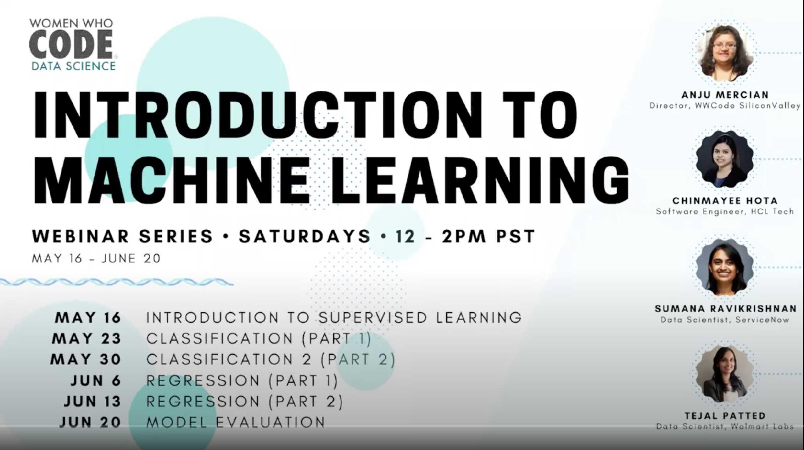

    

# MachineLearningWWC
Serie of Machine Learning courses   
by Sumana Ravikrishnan 
Women Who Code - Data Science  

## Contents:
- [Introdruction to supervisioned learning](https://www.youtube.com/watch?v=HanI00s8NLQ&feature=youtu.be)
- [Classification (part1)](https://www.youtube.com/watch?v=DXG07IJLnf0&feature=youtu.be)
- [Classification (part2)](https://www.youtube.com/watch?v=SpaWs71yFZ4&list=PLVcEZG2JPVhfK8MnBqcxAzwMIfpH0XpX9&index=7&t=0s)
- Regression (part1)
- Regression (part2)
- Model Evaluation

## Tools
- Google Colab
- Python 3.7
